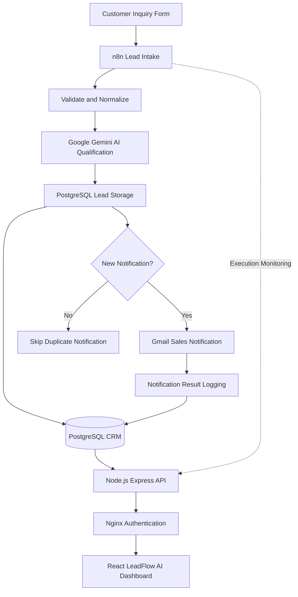

# LeadFlow AI — System Architecture

This diagram illustrates the end-to-end AI lead management automation and dashboard monitoring architecture.

```mermaid
flowchart TD
    A["Customer Inquiry Form"] --> B["n8n Lead Intake"]
    B --> C["Validate and Normalize"]
    C --> D["Google Gemini AI Qualification"]
    D --> E["PostgreSQL Lead Storage"]
    E --> F{"New Notification?"}
    F -->|Yes| G["Gmail Sales Notification"]
    G --> H["Notification Result Logging"]
    F -->|No| I["Skip Duplicate Notification"]

    E --> J[("PostgreSQL CRM")]
    H --> J

    J --> K["Node.js Express API"]
    B -.->|Execution Monitoring| K
    K --> L["Nginx Authentication"]
    L --> M["React LeadFlow AI Dashboard"]
```

